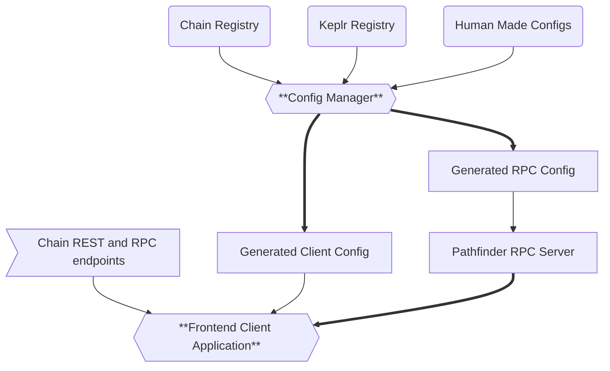

<h1 align="center"> The Spectra 💫 Portal</h1>

Spectra Portal is a standalone DApp that extends the functionality of the Spectra Explorer. This DApp
provides an interface that grants users a way to bridge tokens across different chains using the Inter Blockchain Communication Protocol, and swap tokens across different chains using the Osmosis DEX.

## Table of Contents

- [Table of Contents](#table-of-contents)
- [License](#license)
- [Contributing](#contributing)
- [The Idea Behind the App](#the-idea-behind-the-app)
- [What sets The Spectra Portal apart from other solutions?](#what-sets-the-spectra-portal-apart-from-other-solutions)
- [Requirements for a chain and token to be added to the Spectra Portal](#requirements-for-a-chain-and-token-to-be-added-to-the-spectra-portal)
- [How the app works](#how-the-app-works)
  - [The Config Manager](#the-config-manager)
  - [The Pathfinder RPC](#the-pathfinder-rpc)
  - [The Client App](#the-client-app)
- [Prerequisites](#prerequisites)
- [Deployment and Hosting](#deployment-and-hosting)

## License

This project is licensed under the GNU Affero General Public License v3.0. See the [LICENSE](https://github.com/Cogwheel-Validator/spectra-portal/blob/main/LICENSE) file for details.

It is free to use and modify. Any kind of cosmetic changes are allowed but any kind of changes to the codebase responsible for the core functionality needs to be fully open sourced and publicly available.

## Contributing

If you want to add new chain or a new token to the Spectra Portal, you can do so by creating a new issue in the repository and use the templates.

If you want to contribute to the project, please follow the steps below:

1. Fork the repository
2. Create a new branch
3. Make your changes
4. Push your changes to your fork
5. Create a pull request to the main repository
6. Wait for the review and merge the changes

If you are not a developer, you can still contribute to the project by:

1. Reporting bugs
2. Suggesting features
3. Writing documentation

## The Idea Behind the App

Cross-chain bridging and swapping infrastructure in Cosmos currently relies heavily on
centralized APIs. While existing solutions like Skip Go, Squid Router and others work well, they create
potential single points of failure and limit customization options. And there is no option to host or
modify your own variant. This is where the Spectra Portal comes in.

## What sets The Spectra Portal apart from other solutions?

Spectra Portal addresses this by providing:

- **Fully open-source infrastructure** - Every component, from routing logic, RPC server, config manager, and the client app are fully open sourced and publicly available.
- **Self-hostable architecture** - Run your own instance with complete control over data and uptime
- **Transparent development** - All decisions, feature requests, and chain additions managed publicly via GitHub
- **No gatekeeping** - Any legitimate IBC-enabled chain can be added without arbitrary approval processes

## Requirements for a chain and token to be added to the Spectra Portal

For a blockchain and token to be added to the Spectra Portal, they must meet the following requirements:

For a chain:

- Enabled IBC transfers on the chain
- A fully working IBC relayers ( by validators or by the team behind the chain )
- A public RPC and REST endpoints ( on cosmos.directory or available from other validators )
- An explorer where chain data can be shown ( on Mintscan, PingPub or similar )
- An asset that can actually be transferred to other chains ( very rare that this is not the case )

For a token:

- The chain that the token is on must be supported on the Spectra Portal ( see above )
- The token must be transferable to other chains
- The token must have a human readable name and symbol
- The token must have a decimals value
- The token must have a logo ( URL )

**Note on Explorer Integration:** Chains supported by Cogwheel Validator may be
configured to use Spectra Explorer by default to provide a cohesive user experience.
This can be customized in your self-hosted instance or discussed on a case-by-case basis.

## How the app works

The app consists of 3 main components:

1. The frontend client application
2. The backend rpc server
3. The config manager

### The Config Manager

The config manager is a golang checker program that checks the validity and the integrity of the chain
configurations. It goes through the chain configurations and checks that the blockchain endpoints provided are valid and working. It generates the necessary information about each channel and tokens transferred over the
IBC protocol and the necessary information to generate the necessary configuration files for the pathfinder
rpc server and the frontend client application.

### The Pathfinder RPC

The Pathfinder RPC is a golang RPC server made with the ConnectRPC library that provides a service from where
you can query the pathfinder for the best route to bridge tokens between two chains. It also serves as a
information broker for every chain connected via IBC. You can acquire information about all possible
connections between chains and the tokens available on each chain, while it allows the developer to gather
data by using any of the 3 protocols supported by the Pathfinder: gRPC, gRPC-Web, and HTTP-Connect.

For now any kind of swap operation is powered by the Osmosis DEX and the trades are executed directly on the
Osmosis DEX or are executed using Skip Go CosmWasm Smart Contracts. The trade routing is powered by the
[Osmosis SQS](https://github.com/osmosis-labs/sqs). With this Side car query service the Pathfinder is able
to acquire the necessary information to execute the swap operation on the Osmosis DEX. In the future there
might be more options to choose from but for now this is the only option that is available.

While the Pathfinder is great and fully open sourced, it is not perfect and it has some issues and limitations.

| Feature | Spectra's Pathfinder | Skip Go API |
| -------------------- | ------------ | ---------------------------- |
| Open Source | Yes ✅ | Partially ⚠️( Only SDK, and Widget are Open Source ) |
| Fully Customizable | Yes ✅ | Partially ⚠️ |
| Self-Hostable | Yes ✅ | No ❌ |
| Transfer Across Cosmos SDK chains | Mostly ⚠️ ( chains using non-standard slip44 values, will be resolved in the future) | Yes ✅ |
| Usage of multiple DEXs | No ❌(Only Osmosis is supported for now) | Yes ✅ |
| Transfer Assets to non Cosmos SDK chains | No ❌ | Yes ✅ ( through usage of external APIs such as Axelar and custom made implementation for IBC Eureka (ETH) ) |
| Track transaction progress | No ❌ | Yes ✅ |

The Skip API has many advantages and it is more mature. The Pathfinder is still very new and lacks some
features.

### The Client App

The web app is a Next.js application ran with Bun. According by this
[statistics](https://www.statista.com/statistics/1124699/worldwide-developer-survey-most-used-frameworks-web/)
usage of react is above 40% and Next.js is at 20.8%. So it is a very popular framework. Anyone with the
knowledge of React and Typescript should be able to use the app and make changes to it.

The components of the Spectra Portal might have some pros and cons. However the main focus is to provide a
fully open sourced and publicly available app that provides this kind of functionality.

## Prerequisites

To run the Spectra Portal, you need to have the following prerequisites:

- Golang 1.25.5
- Bun 1.39.0
- Docker

For development purposes, you might need additional tools and dependencies. However these are not required to
run the Spectra Portal.

- Protoc compilers:
  - protoc-gen-go
  - protoc-gen-connect-go
  - protoc-gen-es
  - protoc-gen-connect-es
  - protoc-gen-ts_proto
- Buf CLI
- Golangci-lint
- Govulncheck
- Snyk CLI
- Semgrep CLI
- Biome

## Deployment and Hosting

TODO: Once the repo is publicly available and Github can make docker images publicly available, the deployment and hosting options will be explained.
