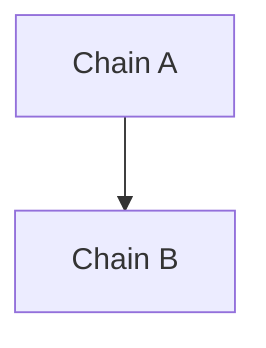
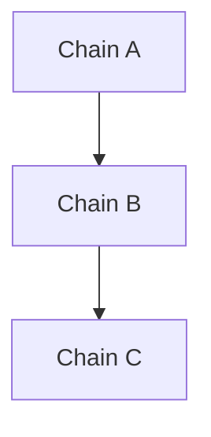
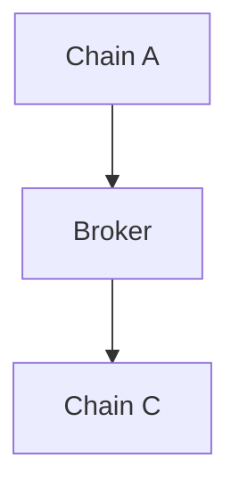
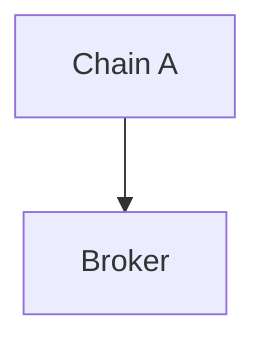

# The Spectra's Pathfinder

The Pathfinder is an information broker for token routing across different chains. The implementation routes tokens via IBC Protocol with optional DEX swaps on broker chains (only Osmosis for now). The pathfinder provides a ConnectRPC service that can be queried to get the necessary information to bridge tokens.

The idea behind the Pathfinder RPC is to provide a service from where you can query the pathfinder for the best route to bridge tokens between two chains. It also serves as a information broker for every chain connected via IBC. You can acquire information about all possible connections between chains and the tokens available on each chain, while it allows the developer to gather data by using any of the 3 protocols supported by the Pathfinder: gRPC, gRPC-Web, and HTTP-Connect.

## How does this RPC work?

With the help of the config manager we can turn the human configured toml files and create config files that
will provide easier time for the Pathfinder to gather from. On the RPC initialization the Pathfinder will load the config files and build the route index.
The route index is a map of all the chains and the tokens available on each chain. It is used to find the best route to bridge tokens between the chains using the BFS(Breadth-First Search) algorithm.

The route index is built using the following algorithm:

1. For each chain, find all the IBC channels and the tokens available on each channel.
2. For each token, find all the channels that the token is available on.
3. For each channel, find all the tokens that are available on the channel.
4. For each token, find all the chains that the token is available on.

## Available endpoints and methods on the RPC

- `FindPath` - Find a route between chains
- `LookupDenom` - Resolve denom information on a specific chain
- `GetTokenDenoms` - Get all IBC denoms for a token across supported chains
- `GetChainInfo` - Get information about a specific chain
- `GetPathfinderSupportedChains` - Get a list of supported chains
- `GetChainTokens` - Get all tokens available on a specific chain
- `/server/ready` - This is a classic http endpoint to check if the RPC is ready to serve requests
- `/server/health` - This is a classic http endpoint to check if the RPC is healthy
- `/server/metrics` - This is a classic http endpoint to get the metrics of the RPC for prometheus if enabled

## Route Types

The pathfinder attempts to find routes in priority order, returning the first successful match:

### 1. Direct Route

Basic IBC bridging from Chain A to Chain B with the same token.

**Requirements:**

- Direct IBC channel between source and destination chains
- Filled data on the cosmos chain registry containing the data abount verified channels between the chains

**Flow:**



**Response Type:** `direct`

---

### 2. Indirect Route (Multi-Hop)

Multiple IBC transfers through intermediate chains without token swaps. The same token travels through all chains.

**Requirements:**

- Each chain is connected in between and the relayer is up and running
- Same token (by origin) available on all intermediate chains
- Each hop has an IBC channel

**Flow:**



**With PFM (Package Forwarding Middleware):**

If all intermediate chains support PFM, the entire route can be executed in a single transaction using IBC memo forwarding. The pathfinder will:

- Detect PFM support on intermediate chains
- Generate the appropriate nested IBC memo
- Return `supports_pfm: true` with the memo

**Without PFM:**

Manual execution required - user must perform each IBC transfer sequentially.

**Response Type:** `indirect`

---

### 3. Broker Swap Route

Route through a broker chain (e.g., Osmosis) that performs a DEX swap to exchange tokens.

**Requirements:**

- Source chain can reach broker via IBC
- Broker has a DEX (only brokers marked with `Broker: true`)
- Broker can reach destination via IBC
- DEX has liquidity for the token pair

**Flow:**



or if the route is the broker chain and this is the final destination



**With PFM on Broker:**

If the broker supports PFM, the swap output can be automatically forwarded to the destination chain in a single transaction. The pathfinder will:

- Query the broker DEX for swap quote
- Check if broker supports PFM
- Generate PFM memo for automatic forwarding of swap output
- Return `execution` with the memo and all the data needed

**Without PFM:**

Two transactions required:

1. Transfer to broker and swap
2. Transfer from broker to destination

**Response Type:** `broker_swap`

---

## Package Forwarding Middleware (PFM)

PFM allows chaining IBC transfers using memos, enabling multi-hop routes in a single transaction.

**How it works:**

- User initiates a single IBC transfer from Chain A
- Chain A includes a special memo with forwarding instructions
- Chain B receives the tokens and automatically forwards them to Chain C
- Process continues until tokens reach final destination

**Requirements:**

- For `A -> B -> C`, Chain B must support PFM (intermediate chains)
- First chain (A) only needs to send the memo
- Last chain (C) only receives, no PFM needed

**Memo Format:**

```json
{
  "forward": {
    "receiver": "cosmos1abc...",
    "port": "transfer",
    "channel": "channel-123"
  }
}
```

For multi-hop paths, memos are nested to specify the entire route.

---

## Route Priority

The pathfinder tries routes in this order:

1. **Direct Route** - Fastest, no intermediate hops
2. **Indirect Route** - Multi-hop without swaps (prefers PFM when available)
3. **Broker Swap Route** - When token exchange is needed

This ensures the pathfinder always returns the most efficient available route.

## How to run the Pathfinder RPC?

In the root of the project there is an `rpc-config.example.toml` file. You can use this file as a template to create your own config file.

```toml
# Spectra's Pathfinder RPC Configuration Example
# Copy this file to rpc-config.toml and customize as needed

# =============================================================================
# RPC Server Configuration
# =============================================================================

# Server address binding
host = "0.0.0.0"
port = 8080

# =============================================================================
# CORS Configuration
# =============================================================================

# Allowed origins for CORS requests
# Use ["*"] to allow all origins (not recommended for production)
allowed_origins = [
    "http://localhost:3000",
    "http://localhost:8080",
    "https://your-frontend.example.com"
]

# Enable gRPC reflection (useful for development tools like grpcurl)
# If you don't want to expose the reflection endpoint, set to false
enable_reflection = true

# =============================================================================
# Rate Limiting
# =============================================================================

# Maximum requests per IP per minute
rate_per_minute = 100

# Set the amount of possible concurrent request possible to the RPC
max_concurrent_requests = 200

# =============================================================================
# Osmosis SQS Configuration
# =============================================================================

# Primary SQS endpoint (Osmosis Sidecar Query Server)
sqs_main_url = "https://sqs.osmosis.zone"

# Backup SQS endpoints for failover (optional)
# The client will automatically switch to backups if the primary is down
backup_sqs_urls = [
    #"https://sqs-osmosis.example.com",
]
# =============================================================================
# OpenTelemetry Configuration (Optional)
# =============================================================================

# Service identification
service_name = "spectra-ibc-hub"
service_version = "1.0.0"
environment = "development"  # PROD, DEV, TEST, LOCAL

# Tracing configuration
enable_tracing = false
use_otlp_traces = false
otlp_traces_url = "http://localhost:4317"

# Metrics configuration
enable_metrics = false
use_prometheus = true        # Expose /metrics endpoint for Prometheus
use_otlp_metrics = false
otlp_metrics_url = "http://localhost:4317"

# Logging configuration
enable_logs = false
use_otlp_logs = false
otlp_logs_url = "http://localhost:4317"

# OTLP connection security (set to true for development without TLS)
insecure_otlp = true

# Development mode - uses console exporters instead of OTLP
development_mode = true

```

When you have your own config file you can use command `make build-pathfinder` which will compile the executable.
The executable will be placed in the `build` directory.

You can then run the executable by executing `./build/pathfinder-rpc` and passing the config file as an argument.

```bash
./build/pathfinder-rpc -config-rpc ./rpc-config.toml
```
